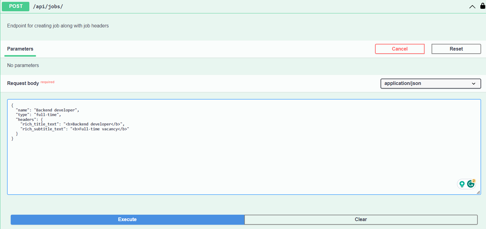
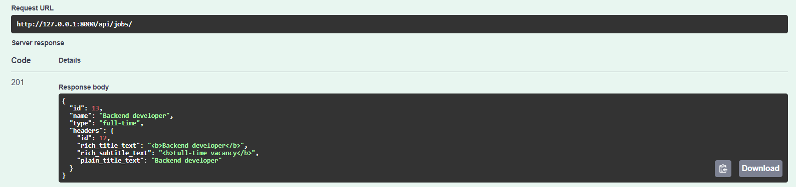
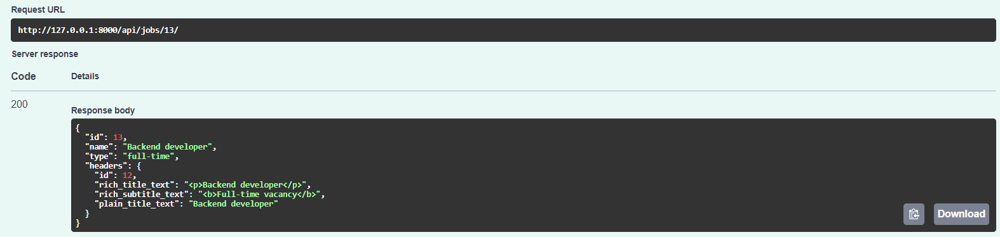
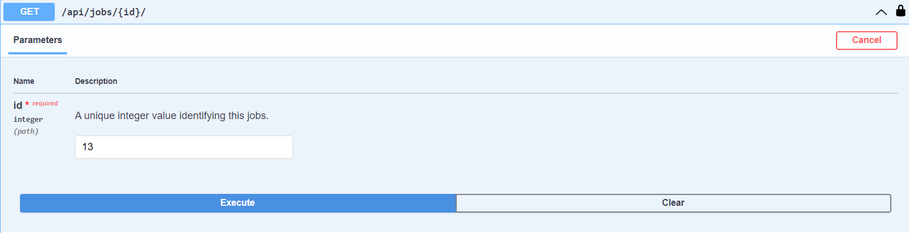
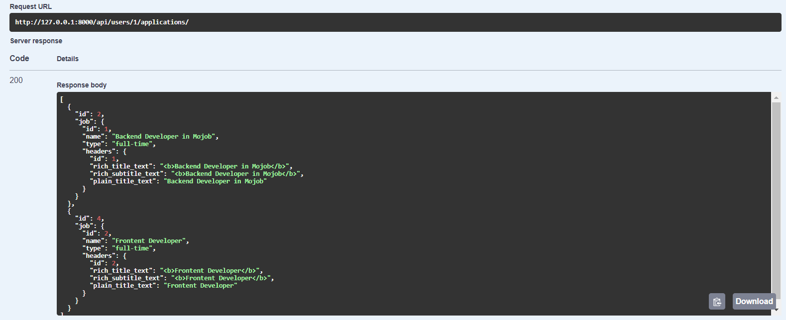

# Recruitment System API

Test task: API for a simple recruitment system where users can apply for jobs.

## Features

* JWT authenticated.
* PostgreSQL.
* Admin panel /admin/
* Documentation at /api/doc/swagger/
* Users can register and manage their profile (/api/users/).
* Authenticated users can create, update, delete jobs along with
job headers.
* Authenticated users can retrieve job by id along with
job headers.
* Authenticated users can retrieve all applications of the user by 
provided user id.
* Calling specific methods on creating/updating jobs.

## How to run locally

Install PostgreSQL and create database.

1. Clone project and create virtual environment

```shell
git clone https://github.com/yuliia-stopkyna/recruitment-system.git
cd recruitment-system
python -m venv venv
source venv/bin/activate # on MacOS
venv\Scripts\activate # on Windows
pip install -r requirements.txt
```
2. Set environment variables

On Windows use ```export``` command instead of ```set```
```shell
set POSTGRES_HOST=<your db host>
set POSTGRES_DB=<your db name>
set POSTGRES_USER=<your db user>
set POSTGRES_PASSWORD=<your db password>
set DJANGO_SECRET_KEY=<your Django secret key>
```
3. Apply migrations, create admin user and run server

```shell
python manage.py migrate
python manage.py createsuperuser
python manage.py runserver
```
## Request/response examples

* Create job

Request


Response


* Update job

Request


Response


* Retrieve job by id

Request


Response


* Retrieve user applications by user id

Request


Response
